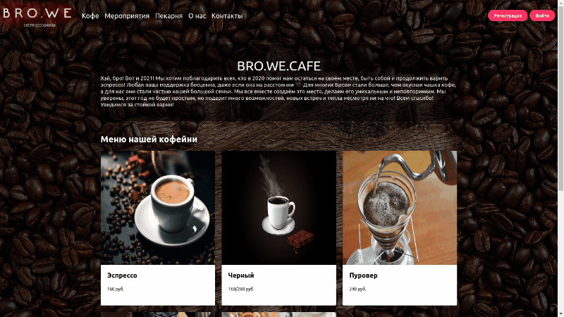

# BRO.WE
BRO.WE - сайт эспрессоварни, где варят кофе собственной обжарки, пекут печенье, пироги и делают торты, каждый день удивляют гостей новинками.

#### Стек технологий используемых в проекте:
* Express
* Node.js
* Handlebars
* CSS Bulma
* Passport.js

#### Запуск проекта:
1. Перейти в корневой каталог
2. Переименовать .env.example в .env и заполнить поля:
 ``` sh
DB_URL=ссылка для подключения к базе данных Atlas
SESSION_SECRET=набор рандомных символов для секретной сессии
PORT=порт на котором будет запущен сервер
```
3. Запустить через консоль командой:
``` sh
$ npm start
```
#### Быстрый обзор сайта

